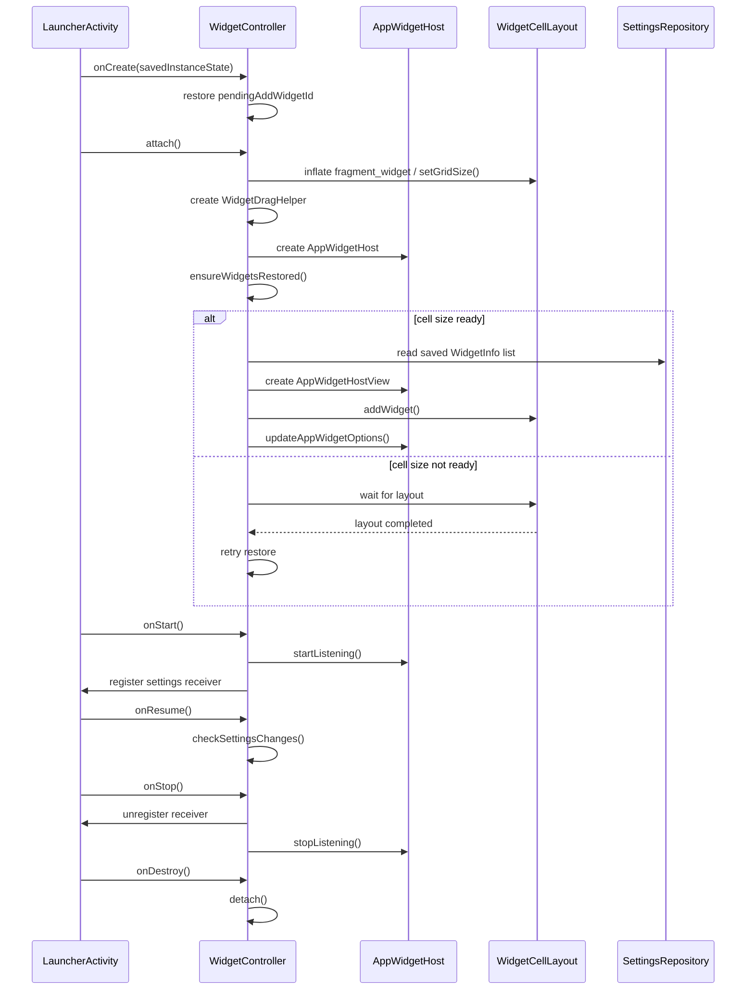
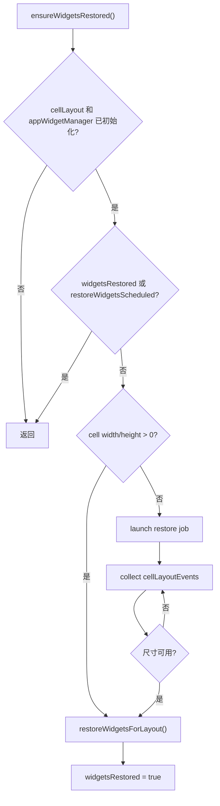
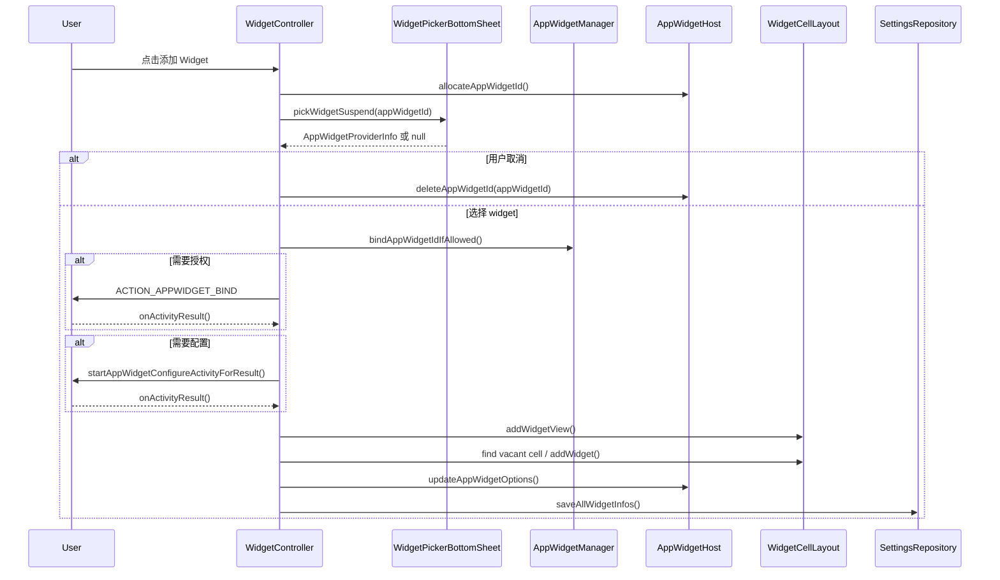
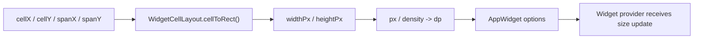
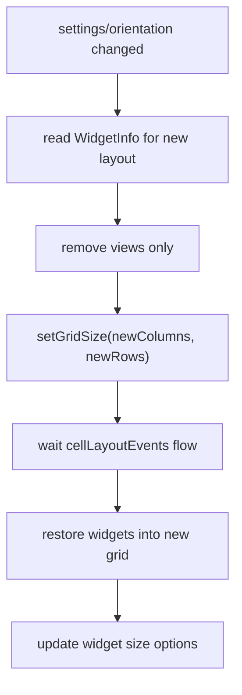

# Widget 生命周期管理

本文整理 Space Launcher 中 widget 面板的生命周期、恢复时机、尺寸同步和资源清理规则。相关实现主要在：

- `LauncherActivity`
- `WidgetController`
- `WidgetCellLayout`
- `WidgetDragHelper`
- `SettingsRepository`

## 角色分工

| 模块 | 责任 |
| --- | --- |
| `LauncherActivity` | 承接 Activity 生命周期、面板打开/关闭手势、将生命周期转发给 `WidgetController`。 |
| `WidgetController` | 管理 `AppWidgetHost`、widget 选择/绑定/配置、恢复、保存、删除、尺寸同步。 |
| `WidgetCellLayout` | 负责 widget 的网格布局、测量、占位、拖拽后的 cell 坐标。 |
| `WidgetDragHelper` | 负责长按编辑、拖拽、调整大小、删除操作，并回调 `WidgetController` 保存变化。 |
| `SettingsRepository` | 按方向和列数持久化 widget 位置信息。 |

## 整体生命周期

## 初始化和恢复

`WidgetController.attach()` 完成以下工作：

1. inflate `fragment_widget` 并加入 `widget_container`。
2. 初始化 `WidgetCellLayout`、`SettingsRepository`、当前方向和列数。
3. 读取当前方向和列数下保存的 `WidgetInfo`，计算初始行数。
4. 创建 `WidgetDragHelper` 并 attach。
5. 创建 `AppWidgetManager` 和 `AppWidgetHost`。
6. 调用 `ensureWidgetsRestored()` 恢复已保存 widget。

恢复不能直接依赖 `attach()` 当下的尺寸，因为第一次打开 widget 面板前，`WidgetCellLayout` 可能尚未完成有效测量。当前规则是：

- `ensureWidgetsRestored()` 是幂等入口。
- 如果 cell 宽高已经可用，立即恢复。
- 如果 cell 宽高未准备好，通过 `cellLayoutEvents` flow 等待后续 layout 事件。
- 后续恢复流程运行在 `lifecycleScope` job 中，layout listener 只负责发事件。
- `LauncherActivity` 在 widget 面板第一次横滑打开时也会调用 `ensureWidgetsRestored()`，避免首次 attach 阶段错过恢复。

## Activity 生命周期转发

`LauncherActivity` 负责把 Activity 生命周期转给 `WidgetController`：

| Activity 回调 | WidgetController 行为 |
| --- | --- |
| `onCreate` | 恢复 `pendingAddWidgetId`。 |
| `onStart` | `AppWidgetHost.startListening()`，注册设置变化广播。 |
| `onResume` | 检查方向、列数、调试显示设置是否变化。 |
| `onStop` | 注销广播，`AppWidgetHost.stopListening()`。 |
| `onSaveInstanceState` | 保存正在绑定/配置中的 `pendingAddWidgetId`。 |
| `onDestroy` | 退出编辑态，dismiss popup，从容器移除 view，重置恢复状态。 |

`startListening()` 和 `stopListening()` 只在 `appWidgetHost` 已初始化后执行。广播注册用 `receiverRegistered` 防重复注册和重复注销。

## 添加 widget 流程

关键规则：

- 选择器取消时必须释放已分配的 `appWidgetId`。
- 绑定或配置失败时必须释放 `appWidgetId` 并清空 `pendingAddWidgetId`。
- 新增 widget 前如果 cell 尺寸未准备好，会延迟到 layout 后再添加。
- 添加成功后立即保存所有 widget 的位置和 span。

## 尺寸同步

Android widget 的尺寸 options 使用 dp，不是 px。当前同步逻辑：

1. 从 `WidgetCellLayout.cellToRect(cellX, cellY, spanX, spanY)` 获取 widget 实际像素区域。
2. 使用 `displayMetrics.density` 转换成 dp。
3. 写入：
   - `OPTION_APPWIDGET_MIN_WIDTH`
   - `OPTION_APPWIDGET_MIN_HEIGHT`
   - `OPTION_APPWIDGET_MAX_WIDTH`
   - `OPTION_APPWIDGET_MAX_HEIGHT`
   - `OPTION_APPWIDGET_SIZES`
4. 调用 `AppWidgetManager.updateAppWidgetOptions(appWidgetId, options)`。

尺寸同步触发点：

- 新增 widget 成功后。
- 恢复 widget 成功后。
- 拖拽移动或调整大小后。
- 布局列数或方向变化后重新添加 widget 时。

## 布局变化

布局变化来源包括：

- 横竖屏切换。
- widget 列数设置变化。
- 调试设置变化，比如网格线和占位背景。

`checkSettingsChanges()` 会读取当前方向和列数。如果方向或列数变化：

1. 更新 `currentIsLandscape` 和 `currentWidgetColumns`。
2. 从对应方向和列数读取保存的 `WidgetInfo`。
3. `clearWidgetViewsOnly()` 只移除 view，不删除 `appWidgetId`。
4. `WidgetCellLayout.setGridSize()` 更新网格。
5. 通过 layout event flow 等待有效 cell 尺寸后调用 `restoreWidgetsWithNewLayout()`。
6. 标记 `widgetsRestored = true`。

注意：布局变化时不能调用 `deleteAppWidgetId()`，否则只是切换方向或列数也会销毁系统 widget 实例。

## 删除和清理

单个删除：

1. 从 `AppWidgetHostView` 读取 `appWidgetId`。
2. 调用 `appWidgetHost.deleteAppWidgetId(widgetId)`。
3. 从 `WidgetCellLayout` 移除 view 并释放占位。
4. 保存剩余 widget 信息。

清空全部：

1. 遍历所有 `AppWidgetHostView`。
2. 对每个有效 id 调用 `deleteAppWidgetId()`。
3. `removeAllViews()` 并清空 occupancy。
4. 清除当前方向和列数下的持久化数据。
5. 标记 `widgetsRestored = true`，避免空数据被重复恢复。

`detach()` 只负责释放当前 UI 绑定：

- 退出编辑态。
- dismiss widget menu。
- 从 container 移除 root view。
- 重置恢复状态。

它不删除系统 widget id，因为 Activity 销毁不代表用户要移除 widget。

## 状态变量

| 变量 | 含义 |
| --- | --- |
| `pendingAddWidgetId` | 绑定或配置流程中暂存的 widget id，用于配置变化后恢复上下文。 |
| `receiverRegistered` | 防止设置变化广播重复注册或重复注销。 |
| `widgetsRestored` | 当前 controller/view 生命周期内是否已经完成恢复。 |
| `restoreWidgetsScheduled` | 是否已经安排了一次等待测量后的恢复，防止重复排队。 |
| `currentWidgetColumns` | 当前方向下的 widget 网格列数。 |
| `currentIsLandscape` | 当前是否横屏，用于选择对应持久化数据。 |

## 维护原则

- `AppWidgetHost.startListening()` 和 `stopListening()` 跟随 Activity start/stop。
- UI view 的 attach/detach 不等于删除 widget id。
- 恢复 widget 必须等待 `WidgetCellLayout` 有有效 cell 尺寸。
- 所有 size options 都必须使用 dp。
- 列数或方向变化只重建 view，不删除系统 widget id。
- 用户明确删除或清空时，才调用 `deleteAppWidgetId()`。
- 任何位置、大小变化后，都要保存 `WidgetInfo` 并更新 widget size options。
